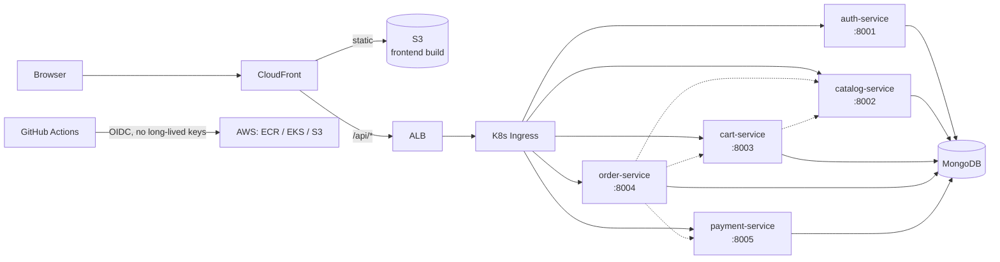

# Sports Store AWS Infrastructure

> **Part of the Sports Store platform** — a 9-repo polyrepo microservices project. Map: [frontend](https://github.com/yuvalfarkash/sports-store-frontend) · [gateway](https://github.com/yuvalfarkash/sports-store-gateway) · [auth](https://github.com/yuvalfarkash/sports-store-auth-service) · [catalog](https://github.com/yuvalfarkash/sports-store-catalog-service) · [cart](https://github.com/yuvalfarkash/sports-store-cart-service) · [order](https://github.com/yuvalfarkash/sports-store-order-service) · [payment](https://github.com/yuvalfarkash/sports-store-payment-service) · [deployments](https://github.com/yuvalfarkash/sports-store-deployments) · [local dev](https://github.com/yuvalfarkash/sports-store-local)

## Architecture



## AWS account boundary

This configuration targets whichever AWS account and principal are configured
in the local, git-ignored `config/aws-environment.json` (see
`config/aws-environment.json.example` for the expected shape) — for example an
account `123456789012` in `eu-central-1` with default approved deployment and
EKS administration principal `arn:aws:iam::123456789012:user/deploy-user`. Both
Terraform roots and every mutating operational script reject any other active
AWS account before changes begin. Verify identity with
`aws sts get-caller-identity --output json`.
The scripts require `jq` and accept structurally valid IAM user, IAM role, or
STS assumed-role caller identities only; the returned account must still match
`expected_account_id` from that local configuration file.

Do not commit long-lived access keys. GitHub Actions assumes Terraform-created
roles through OIDC and temporary credentials. The five backend repositories use
`AWS_REGION` and `AWS_ECR_PUBLISH_ROLE_ARN`. The frontend uses `AWS_REGION`,
`AWS_STATIC_SITE_ROLE_ARN`, and `AWS_STATIC_SITE_BUCKET`; its dedicated role can
only synchronize objects in the exact static-site bucket. `deploy.sh` sets and
reads back these non-secret variables before dispatching `ci.yaml` on `main`
for the exact remote `main` revision. It never configures the local-only
Gateway.

GitHub repositories created after July 15, 2026 use immutable default OIDC
subject claims. For these repositories, IAM trust uses the exact form
`repo:ORGANIZATION_LOGIN@ORGANIZATION_ID/REPOSITORY_NAME@REPOSITORY_ID:ref:refs/heads/main`.
The Sports Store organization ID and the six approved repository IDs are stored
in Terraform as non-secret security identifiers. Repository names alone are no
longer sufficient because the token subject includes both the human-readable
name and immutable numeric identity. This prevents a newly created repository
that reuses an old name from inheriting publication access.

Verify the identifiers through read-only GitHub API calls before reviewing a
trust change:

```bash
gh api /orgs/yuvalfarkash --jq '{login, id}'
gh api /repos/yuvalfarkash/REPOSITORY --jq '{name, id, owner: .owner.login, owner_id: .owner.id, created_at, archived}'
```

Renaming the organization or a repository does not change its immutable numeric
identity, although the reviewed subject string must reflect the current login
and name. Adding or replacing a repository always requires an explicit reviewed
Terraform trust-policy update; there is no organization-wide or repository-wide
wildcard fallback.

Sports Store workflows pin Trivy Action `v0.36.0` to the verified immutable
commit `a9c7b0f06e461e9d4b4d1711f154ee024b8d7ab8`, following Aqua's
[official supply-chain advisory](https://github.com/aquasecurity/trivy/security/advisories/GHSA-69fq-xp46-6x23).
Review GitHub workflow logs from March 19-20, 2026 and rotate potentially
exposed credentials if evidence shows an affected mutable tag ran then.

The partially deployed base Terraform state owns the single GitHub Actions OIDC
provider in the target AWS account for
`https://token.actions.githubusercontent.com`, with `sts.amazonaws.com` as its
only client ID, before creating the ECR publishing role that references its ARN.
The provider configuration intentionally omits TLS thumbprints: the pinned AWS
provider supports omission, allowing AWS IAM to use its trusted root CA library
instead of storing a brittle SHA-1 thumbprint.

The OIDC provider is account-wide. Do not manually delete it while GitHub
Actions depends on it. Terraform's dependency graph removes the publishing role
and its policies before the provider during a base-state destroy. If another
project later shares this provider, reconsider its state ownership and destroy
lifecycle before destroying this base Terraform state.

Terraform in `terraform/` defines the AWS foundation: networking, EKS, add-ons, workload IAM, five backend ECR repositories, the private static-site S3 bucket, publication roles, the application secret container, and External Secrets Operator. The isolated `terraform/cloudfront/` root manages the distribution, S3 OAC, CloudFront Function, and distribution-dependent bucket policy after Kubernetes has produced an ALB hostname. Application workloads remain GitOps-managed.

## Architecture

- One VPC spanning two availability zones
- Two public subnets tagged for internet-facing load balancers
- Two private subnets tagged for internal load balancers
- One shared NAT Gateway for the course environment
- An EKS 1.34 cluster with a public API endpoint
- EKS `api`, `audit`, and `authenticator` control-plane logs retained in
  CloudWatch Logs for seven days
- One managed node group using `AL2023_x86_64_STANDARD` and three On-Demand
  `t3.medium` nodes by default, with minimum 2 and maximum 4
- Argo CD, External Secrets Operator chart `2.8.0`, the AWS Load Balancer Controller, and Argo CD Image Updater are
  configured with reduced resource usage in `helm.tf`
- EKS-managed CoreDNS, kube-proxy, VPC CNI, and EBS CSI add-ons
- Dedicated IRSA roles for EBS CSI, AWS Load Balancer Controller, and External Secrets Operator
- An AWS Secrets Manager container named `sports-store/production/app`; Terraform creates no secret version
- Five immutable, scan-on-push backend ECR repositories
- A shared backend ECR publisher role plus a dedicated least-privilege frontend S3 publisher role, both restricted to approved `main` subjects
- A private, SSE-S3-encrypted, bucket-owner-enforced static bucket with all public-access blocks enabled
- A low-cost `PriceClass_100` CloudFront distribution using its default domain and certificate, signed S3 OAC requests, and an HTTP ALB API origin

All Terraform-managed AWS resources receive the `Project=sports-store`, `Environment=dev`, and `ManagedBy=terraform` tags where AWS supports tagging.

The EKS module has `enable_cluster_creator_admin_permissions = true`, so it is
the sole Terraform owner of the deployment principal's EKS access entry and
`AmazonEKSClusterAdminPolicy` association. `additional_eks_principal_arns` is
only for genuinely additional same-account administrators. The standalone
access resources deduplicate that list and filter the deployment principal if
it is repeated accidentally; callers should still omit that principal from the
variable.

Terraform installs the AWS Load Balancer Controller first and waits, with a
bounded timeout, for its Helm release to become ready. External Secrets, Argo
CD, and Metrics Server explicitly depend on that release; Argo CD Image Updater
then waits transitively through Argo CD. This prevents Service-creating charts
from racing the controller's mutating webhook before its Service has endpoints.

The external request path is:

```text
User -> CloudFront -> private S3 (frontend and static assets)
User -> CloudFront /api/* -> ALB -> Ingress -> FastAPI services
```

Viewers are redirected from HTTP to HTTPS. CloudFront signs S3 requests with OAC; direct S3 access is blocked and no website endpoint is configured. `/assets/*` uses long caching for Vite content hashes, while the default S3 behavior does not retain `index.html`; extensionless SPA routes are rewritten by a viewer-request function. `/api/*` remains uncached and forwards required methods, cookies, queries, authorization, and CORS headers to the internet-facing ALB over HTTP. Direct ALB access remains available only for API troubleshooting. There is no custom domain, Route 53 record, ACM certificate, or ALB HTTPS in this version.

CloudWatch collects EKS control-plane logs. Separately, four Terraform-managed
Argo CD Applications reconcile monitoring (wave 0), Loki 18.5.0 (wave 1),
Alloy 1.11.0 (wave 2), and the Sports Store workload (wave 3). Loki and Alloy
read their values from `sports-store-deployments/main`; no Application targets
the development branch. Workload logs stay internal to the cluster and use
small, ephemeral storage as documented in that repository.

## EKS node capacity and failure limits

The AWS workload was rendered and audited against the pinned chart versions on
2026-08-16. It includes the five FastAPI services, MongoDB, External Secrets
Operator, AWS Load Balancer Controller, Argo CD, Argo CD Image Updater,
metrics-server, Prometheus, Grafana, Alertmanager, kube-state-metrics,
node-exporter, Prometheus Operator, Loki, Alloy, and the EKS system add-ons. The
AWS frontend Deployment, Service, metrics sidecar, ServiceMonitor, and `/`
Ingress route are disabled because CloudFront serves the frontend from private
S3. Local rendering still includes the frontend.

Scheduler-effective resource totals use Pod requests, including the
Prometheus config-reloader sidecars. Containers that intentionally omit a
request or limit contribute zero for that field. Current `most_recent` EKS
add-on versions were resolved for Kubernetes 1.34 when the audit was performed;
because those add-ons are not pinned, repeat the audit before a later apply if
AWS changes their defaults.

| Workload group | Pods with 3 nodes | CPU requests | Memory requests | CPU limits | Memory limits |
| --- | ---: | ---: | ---: | ---: | ---: |
| Five FastAPI services | 5 | 100m | 320Mi | 750m | 640Mi |
| MongoDB | 1 | 50m | 128Mi | 300m | 384Mi |
| Platform controllers (External Secrets, load balancer, Argo CD, Image Updater, metrics-server) | 11 | 270m | 648Mi | 0m | 1,376Mi |
| Prometheus, Grafana, Alertmanager, kube-state-metrics, node-exporter, Prometheus Operator, Loki, Alloy | 10 | 430m | 1,104Mi | 1,675m | 2,528Mi |
| EKS system Pods and add-ons | 13 | 840m | 836Mi | 0m | 3,412Mi |
| **Total** | **40** | **1,690m** | **3,036Mi** | **2,725m** | **8,340Mi** |

Four DaemonSets run on each Linux node: VPC CNI, kube-proxy, EBS CSI node,
and node-exporter. Their per-node scheduling overhead is 4 Pods, 195m CPU, and
136Mi memory; their declared limits total 100m CPU and 384Mi memory. The other
28 Pods are fixed-count workloads, including two CoreDNS and two EBS CSI
controller Pods.

A `t3.medium` has 2 vCPU and 4GiB memory. The EKS-optimized AL2023 bootstrap
reserves 70m CPU and, at 17 Pods, 442Mi memory (`255Mi + 11Mi * maxPods`);
kubelet also keeps a 100Mi hard memory-eviction threshold. Using advertised
instance capacity gives an estimated per-node allocatable 1,930m CPU and
3,554Mi memory, or 5,790m and 10,662Mi across three nodes. Actual reported
memory can be slightly lower because the operating system and kernel reduce
the capacity visible to kubelet. Against the estimate, steady-state request
headroom is about 4,100m CPU and 7,626Mi memory.

VPC CNI prefix delegation remains disabled. A `t3.medium` supports 3 ENIs with
6 IPv4 addresses each, so the supported ENI-based kubelet limit is
`3 * (6 - 1) + 2 = 17` Pods. The removed `maxPods: 110` override could not
create the missing VPC IP capacity. Three nodes therefore provide 51 Pod slots:
40 are expected in steady state and 11 remain for a sequential rolling surge,
the transient Argo CD Redis initialization Job, and similar short-lived work.
More than 11 simultaneous surge Pods can remain Pending.

The configuration is not N-1 schedulable by Pod count. After one node is lost,
28 fixed Pods plus 8 DaemonSet Pods require 36 slots, while two nodes provide
only 34. CPU and memory requests would still fit (about 1,495m and 2,900Mi
against an estimated 3,860m and 7,108Mi), but at least two Pods can remain
Pending. This is a deliberate limitation of the requested small course
configuration, not high-availability capacity.

### Scaling semantics

`desired_size = 3` means three nodes normally run. `min_size = 2` and
`max_size = 4` are permitted managed-node-group boundaries; they do not enable
automatic scaling. No Cluster Autoscaler or Karpenter component is installed,
so Kubernetes cannot add a node when Pods are Pending. Scaling must be done
through a reviewed Terraform change or directly through EKS/Auto Scaling;
direct manual scaling makes the live desired count differ from configuration
(the EKS module intentionally ignores subsequent desired-size drift).

### MongoDB Availability Zone constraint

The node group remains attached to both private subnets across the existing two
Availability Zones. The `ebs-sc` StorageClass still uses the EBS CSI Driver,
`WaitForFirstConsumer`, `Retain`, and the existing EBS-backed MongoDB PVC. Once
provisioned, that EBS volume belongs to one Availability Zone. Kubernetes can
schedule MongoDB only onto a node in that same zone. Three nodes spread across
two zones do not guarantee that every zone has capacity at every moment; if no
node is available in the volume's zone, MongoDB can remain `Pending`. MongoDB
has one standalone replica and is not highly available.

### Expected effect of a future Terraform apply

No apply was run for this change. With the locked AWS provider, changing
`aws_eks_node_group.instance_types` is a replacement operation. The EKS module
uses name prefixes and `create_before_destroy`, so a reviewed apply is expected
to create a new managed node group with three `t3.medium` nodes before deleting
the old twelve-node group. End state remains one node group, but both groups can
coexist during replacement, temporarily reaching as many as 15 nodes plus any
EKS update surge. Quotas, subnet IP availability, and temporary cost must be
reviewed in the real plan.

When the old group is deleted, EKS drains its nodes and evicts reschedulable
Pods onto the new group. PodDisruptionBudgets and termination grace periods can
slow this process. MongoDB can restart only after an eligible new node exists
in its EBS volume's zone and the volume detaches and reattaches. Because several
components are single-replica, the cluster is not N-1 schedulable by Pod count,
and MongoDB is zonal, downtime is possible; zero downtime is not promised.

## Required tools

- Terraform 1.5.7 or newer
- An HCP Terraform account for the intended remote workflow
- AWS CLI and an AWS account with sufficient provisioning permissions
- Git and access to the `sports-store-infrastructure` repository
- Bash, OpenSSL, and AWS CLI for the one-time application-secret bootstrap
- `jq` for structured AWS configuration and caller-identity validation
- `kubectl` and GitHub CLI (`gh`) for the deployment workflow

## HCP Terraform setup

The HCP Terraform organization and workspace must be created separately; their names are intentionally not hard-coded in this repository. This external setup cannot be validated from repository files alone.

Create a VCS-driven HCP Terraform workspace for the base root with:

- VCS repository: `sports-store-infrastructure`
- Terraform working directory: `terraform`
- VCS-driven speculative plans for changes
- Remote state stored and locked by HCP Terraform
- AWS authentication through HCP Terraform dynamic provider credentials/OIDC

Configure the required HCP Terraform project, workspace, variable set, AWS trust, and run permissions outside Git. Remove any legacy `mongodb_root_password` and `jwt_secret` workspace variables: this configuration no longer accepts them. Do not store long-lived AWS access keys in this repository or commit Terraform state.

The CloudFront root has independent lifecycle and state so a repeated stage-1 apply cannot plan deletion of an existing distribution merely because an ALB hostname is not yet available as an input. Configure a second state/backend for working directory `terraform/cloudfront`; do not point both roots at the same state. Preserve and lock both states.

Each AWS account this is deployed into must use two new, empty, separately
locked states: one for `terraform/` and one for `terraform/cloudfront/`. Never
copy, select, migrate, import, overwrite, or reuse state from another AWS
account. Before the first deployment into a new account, initialize each root
against its new backend and confirm `terraform state list` is empty. The
scripts reject non-empty legacy state without the expected-account output.

## Initialize and validate

From the repository root:

```bash
terraform -chdir=terraform init
terraform -chdir=terraform fmt -recursive
terraform -chdir=terraform fmt -check -recursive
terraform -chdir=terraform validate
terraform -chdir=terraform providers
terraform -chdir=terraform/cloudfront init
terraform -chdir=terraform/cloudfront fmt -check -recursive
terraform -chdir=terraform/cloudfront validate
terraform -chdir=terraform/cloudfront test
```

For a local CLI review without configuring a backend:

```bash
terraform -chdir=terraform init -backend=false
terraform -chdir=terraform plan
```

Do not use a local plan as a substitute for the reviewed VCS-driven HCP Terraform plan.

## Two-stage deployment

The ALB is created asynchronously by AWS Load Balancer Controller only after Argo CD creates the Helm Ingress. Terraform therefore cannot know the ALB hostname during the initial base plan. The two independent roots avoid a circular dependency and require no provisioner, generated variable file, direct AWS CLI CloudFront mutation, or Terraform state manipulation.

On a workstation authenticated to the target AWS account, review the expected plans and run from the repository root:

```bash
bash deploy.sh
```

The script performs this sequence:

1. Verifies the configured target account and validates both state roots.
2. Applies the base root in the target account.
3. Reads and validates the static bucket and both publisher-role outputs. It configures the frontend's three static-publication variables, then the five backends' ECR variables. For every application repository it reads the exact remote `main` SHA, dispatches `ci.yaml` on `main` with `expected_sha` and a unique `deployment_id`, correlates the exact newly created run, and watches that run to completion. Historical workflow runs are never rerun.
4. Bootstraps the first Secrets Manager version without printing its values.
5. Configures `kubectl`, waits for Argo CD and the ALB with bounded polling, and validates the hostname.
6. Applies the separate CloudFront root with the validated ALB and S3 inputs, then prints the CloudFront HTTPS URL and direct ALB API troubleshooting URL. `deploy.sh` never uploads frontend files; GitHub Actions owns the build and S3 synchronization.

On a clean deployment the CloudFront root contains no distribution until stage 2 receives a valid hostname. On a repeated deployment, the base root cannot alter the distribution because it has separate state; stage 2 idempotently reconciles the existing distribution with the current Ingress hostname. This also accommodates an ALB replacement.

If `deploy.sh` stops partway through the base Terraform apply, preserve
`terraform/terraform.tfstate`, its backup, and `terraform/.terraform`. Correct
the underlying configuration or readiness problem, then rerun `bash deploy.sh`
from the same repository directory. Terraform resumes from the resources
recorded in the local state. Do not delete or recreate the state as a recovery
step. A corrective code-only change does not itself deploy or repair live
resources.

The August 2026 frontend workflow failed while requesting
`sts:AssumeRoleWithWebIdentity`, before it received AWS credentials, so it did
not upload any object to S3. After the immutable trust-policy correction reaches
`main`, run `bash deploy.sh` again. The script creates a new revision-safe
workflow dispatch for the exact current `main` SHA; do not rerun the historical
failed workflow run. The resumed deployment first updates the two existing IAM
role trust policies in place, then continues its normal publication, secret
bootstrap, ALB discovery, and CloudFront stages.

Because AWS no longer runs a frontend Kubernetes workload, the base configuration removes the now-unused `sports-store-frontend` ECR repository and its shared ECR publication permission. A future reviewed base apply will delete that repository and any images it contains (`force_delete = true`); no live deletion was performed while implementing this change.

Terraform installs platform operators and the Argo CD bootstrap Application, but it does not declare the Sports Store Deployments, Services, or MongoDB workload. The first deployment still requires the manual application-secret bootstrap described below; the deployment script never reads or prints secret values.

Useful outputs after a successful apply include:

```bash
terraform -chdir=terraform output
terraform -chdir=terraform output -raw eks_cluster_name
terraform -chdir=terraform output -raw aws_load_balancer_controller_iam_role_arn
terraform -chdir=terraform output -raw application_secret_name
terraform -chdir=terraform output -raw application_secret_arn
terraform -chdir=terraform output -raw external_secrets_iam_role_arn
terraform -chdir=terraform/cloudfront output -raw cloudfront_domain_name
terraform -chdir=terraform/cloudfront output -raw cloudfront_https_url
```

The outputs also expose the cluster endpoint, AWS region, VPC and subnet IDs, backend ECR URLs, both publishing role ARNs, the static bucket name/ARN/regional domain, and EBS CSI role ARN. All outputs are non-sensitive metadata. The complete public application address is `cloudfront_https_url`.

## CloudFront behavior

The first ordered behavior, `/api/*`, targets the ALB, permits every required application method, uses AWS-managed `CachingDisabled`, and uses `AllViewerExceptHostHeader` to preserve query strings, cookies, authorization, CORS preflights, and other viewer headers without forwarding the viewer Host. Authenticated and private API responses are never cached.

The second behavior, `/assets/*`, targets private S3, permits only safe reads, forwards no cookies or authorization, enables compression, and caches Vite content-hashed assets for one year. The default behavior also targets S3 but uses zero TTLs so `index.html` becomes visible without broad invalidations. Its CloudFront Function rewrites only extensionless frontend paths to `/index.html`, preserves query strings, and leaves `/api/*`, `/assets/*`, and filenames unchanged.

## Application secret workflow

AWS Secrets Manager is the source of truth. Terraform creates only the deterministic `sports-store/production/app` container and metadata; it deliberately has no `aws_secretsmanager_secret_version` resource. External Secrets Operator runs in the dedicated `external-secrets` namespace. Its Helm-created `external-secrets` ServiceAccount is annotated with a least-privilege IRSA role whose trust is restricted to that exact namespace and ServiceAccount and whose policy can only describe/read this secret ARN.

After the first successful Terraform apply, you can inspect or populate the first version from a machine authenticated to the intended AWS account:

```bash
bash scripts/bootstrap-application-secrets.sh --check
bash scripts/bootstrap-application-secrets.sh
```

The script reads `aws_region` and `application_secret_name` from Terraform outputs. Set `AWS_REGION` (or `AWS_DEFAULT_REGION`) and `SPORTS_STORE_SECRET_ID` to use explicit values instead. It displays only account ID, caller ARN, region, secret name, and version presence; generated values and JSON are never printed. The first write requires typing `yes`. A normal run refuses to overwrite `AWSCURRENT`; `--rotate` is an explicit break-glass operation, not part of deployment.

The required order is:

```text
Terraform apply
-> bootstrap AWS secret values
-> wait for ExternalSecret synchronization
-> verify app-secrets exists
-> verify MongoDB and application workloads
```

Verify synchronization without reading values:

```bash
kubectl get secretstore,externalsecret -n sports-store
kubectl describe secretstore sports-store-aws-secrets -n sports-store
kubectl describe externalsecret app-secrets -n sports-store
kubectl wait --for=condition=Ready externalsecret/app-secrets -n sports-store --timeout=120s
kubectl get secret app-secrets -n sports-store -o go-template='{{range $key, $_ := .data}}{{printf "%s\n" $key}}{{end}}'
kubectl get pods -n sports-store
```

The final command lists keys only. The expected keys are `mongodb-root-password`, `JWT_SECRET`, and the five `*_MONGO_URI` keys. Never use a command that prints `.data`, decoded values, or the AWS `SecretString` during routine verification.

No secret value belongs in Git, Terraform variables, Terraform state, Helm values, command history, CI logs, or ordinary terminal output. Existing historical state created by the removed Kubernetes Secret resource must remain access-controlled under the existing state-retention policy; the new configuration supplies no secret inputs and stores no application secret values in future state snapshots.

External Secrets refreshes the Kubernetes Secret on its configured interval. Pods that consume keys as environment variables must be restarted to observe a changed JWT, and old JWTs become invalid after all services use the new signing key. Do not use the bootstrap script's `--rotate` option for a JWT-only change: it regenerates both properties. The MongoDB root password is persisted inside the database, so changing only AWS/Kubernetes data does not update MongoDB and will break authentication. MongoDB rotation requires a separate coordinated procedure covering the database credential, AWS secret update, ExternalSecret sync, and controlled workload restarts.

An expected first plan creates the Secrets Manager metadata container, the scoped IAM role and inline read policy, the `external-secrets` namespace, the pinned operator Helm release, and updates the Argo CD Application dependency/revision. It destroys the old Terraform-managed `kubernetes_secret.app_secrets`. Review that removal carefully; do not run a normal deployment until the AWS secret is bootstrapped and the GitOps chart change is available on `main`.

## Destroy procedure

Confirm persistent-data and backup requirements, ensure both Terraform states are available, and run `bash destroy.sh` from the authenticated workstation. Do not remove the Ingress first. The script uses this order:

1. Verifies the configured target account and rejects unexpected base or CloudFront state before deletion.
2. Initializes the isolated CloudFront root and, if its state contains resources, destroys the distribution, OAC, bucket policy, cache policy, and rewrite function. If stage 2 never ran, this is a no-op. The bucket policy disappears before the base-owned bucket.
3. Selects the exact EKS cluster from base Terraform outputs, deletes the Argo CD Application so self-heal cannot recreate the Ingress, captures and validates the Ingress hostname, and deletes the namespace's Ingress.
4. Polls for the exact captured ALB DNS name for at most 30 attempts at 10-second intervals. It stops with an error instead of destroying the VPC if the ALB remains.
5. Performs the scoped controller-security-group cleanup, destroys the base state, and reports retained available EBS volumes. The base destroy permanently deletes all static files because `force_destroy = true`; scripts never delete the bucket or objects through AWS CLI.

To add another EKS administrator later, supply an explicit same-account IAM user
or role ARN through `additional_eks_principal_arns` in an approved, uncommitted
Terraform variable file. Validation rejects account root, wildcards, and other
accounts.

CloudFront is never created or deleted with AWS CLI. The separate CloudFront state is intentionally destroyed before Kubernetes or ALB changes, works when the distribution or ALB is already absent, and keeps normal create/destroy operations idempotent. Do not discard either Terraform state before completing this sequence.

Both Terraform states remain required: base owns the bucket, while CloudFront state owns the policy that grants distribution access. Normal apply order is base, frontend publication and API readiness, then CloudFront. Normal destroy order is CloudFront, Argo CD/Ingress/ALB cleanup, then base.

CloudFront creation and updates commonly need several minutes to propagate globally. Disabling and deleting a distribution can take 15-30 minutes or longer; Terraform waits for the AWS operation and must not be interrupted. These delays are expected and do not justify deleting the distribution outside Terraform.

The application secret sets `recovery_window_in_days = 0`. Terraform destroy therefore permanently deletes its container and versions instead of leaving the deterministic name scheduled for deletion, allowing a later course-environment apply to recreate the same name. This is intentionally irreversible: preserve any values needed for recovery through an approved secret backup/rotation procedure before destroy. AWS deletion is asynchronous, so an immediate recreate can still require a short retry with backoff.

## Troubleshooting

These commands expose status and metadata only:

```bash
terraform -chdir=terraform output -raw eks_cluster_name
terraform -chdir=terraform output -raw aws_region
terraform -chdir=terraform/cloudfront output
terraform -chdir=terraform/cloudfront state list
kubectl get application sports-store -n argocd
kubectl get ingress sports-store -n sports-store -o wide
kubectl describe ingress sports-store -n sports-store
kubectl get events -n sports-store --sort-by=.lastTimestamp
```

An absent CloudFront output means stage 2 has not successfully completed in the currently selected CloudFront state. An empty Ingress address means AWS Load Balancer Controller has not assigned the ALB yet; inspect the Ingress events and controller status without reading Kubernetes Secrets or AWS Secrets Manager values.

## Cost warning

EKS, the NAT Gateway, EC2 managed-node instances, EBS volumes, load balancers, CloudFront requests, CloudFront data transfer, and origin data transfer can incur charges. `PriceClass_100` limits edge locations to the lowest-cost CloudFront price class for this course environment, but it does not make requests or transfer free. A shared NAT Gateway reduces course-environment cost but is not highly available across availability zones. Monitor usage and destroy resources when they are no longer required.

At the configured desired capacity, expect one chargeable EKS control plane, one NAT Gateway, three `t3.medium` On-Demand EC2 nodes and their root EBS volumes (with configured boundaries of two to four), ECR image storage, application EBS volumes such as the MongoDB PVC, one ALB, and one CloudFront distribution. No automatic node scaler is installed. Actual counts and charges can change through manual scaling, upgrades, replacement overlap, retained volumes, and workload configuration.
